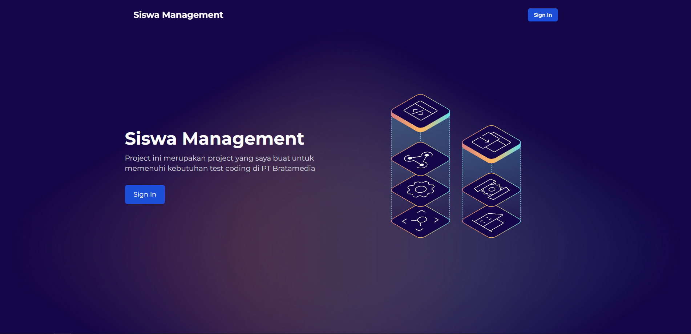

# Siswa Management

Proyek ini merupakan aplikasi manajemen siswa yang dibuat untuk memenuhi kebutuhan tes coding di PT Bratamedia. Aplikasi ini terdiri dari dua bagian utama: `backend` dan `frontend`.



## Fitur Utama

- CRUD data Siswa.
- CRUD data Guru.
- CRUD data Kelas.
- Autentikasi berbasis token (JWT).
- Koneksi ke database MySQL.

## Prasyarat

Pastikan Anda sudah menginstal:

- [Node.js](https://nodejs.org/) (versi terbaru direkomendasikan).
- [MySQL](https://www.mysql.com/) untuk database.

## Instalasi

### 1. Clone Repository

Jalankan perintah berikut untuk menyalin repository ke komputer Anda:

```bash
git clone https://github.com/SukunDev/siswa-management.git
cd siswa-management
```

### 2. Install Dependencies

#### Backend

Masuk ke direktori `backend` dan jalankan perintah berikut:

```bash
cd backend
npm install
```

#### frontend

Masuk ke direktori `frontend` dan jalankan perintah berikut:

```bash
cd frontend
npm install
```

## Konfigurasi

### Backend

Edit file `.env` di direktori `backend` sesuai dengan konfigurasi Anda:

```
PORT=5000

DATABASE_DIALECT=mysql
DATABASE_USER="root"
DATABASE_HOST="localhost"
DATABASE_PASSWORD=""
DATABASE_DB="siswa_management"

JWT_SECRET=<secret-code>
```

### Frontend

Edit file `.env.local` di direktori `frontend`:

```
NEXT_PUBLIC_REST_API_URL="http://localhost:5000"
NEXT_PUBLIC_URL="http://localhost:3000"
NEXT_PUBLIC_TITLE="Siswa Management"
NEXT_PUBLIC_DESCRIPTION="Ini Deskripsi"
```

## Cara Menjalankan

### 1. Menjalankan Backend

Pindah ke direktori `backend` dan jalankan perintah berikut:

```
cd backend
npm run seeder
npm run dev
```

### 2. Menjalankan Frontend

Pindah ke direktori `frontend` dan jalankan perintah berikut:

```
cd frontend
npm run dev
```

### 3. Buka Server

Buka url frontend nya. biasanya berada di `http://localhost:3000`

- username : admin
- password : admin

## Teknologi yang Digunakan

- Backend: Node.js, Express, MySQL
- Frontend: Next.js
- Database: MySQL

## Catatan

Pastikan MySQL sudah berjalan di sistem Anda.
Gunakan nilai unik dan rahasia untuk `JWT_SECRET` di file `.env`.
